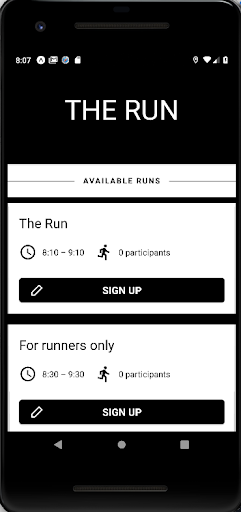
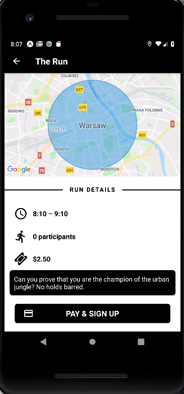
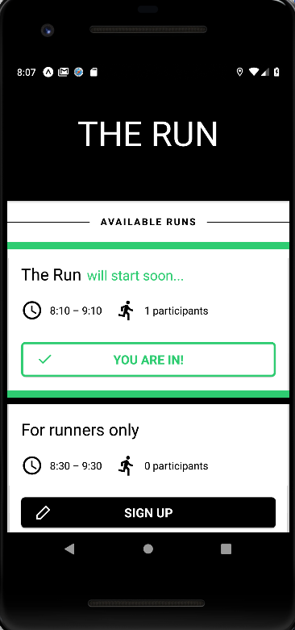
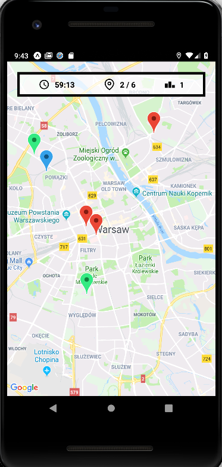

# HackYeah 2018 -- The Run

A luck based, geolocation, urban game.

## Our story

We wanted to crate an engaging and awarding game that could also promote physical activity. Players can enter the competition in just a couple of touches. The goal is to visit all locations within the time limit. The sooner you finish -- the bigger cut of the stake you get.

We thought about setting categories with restricted legal means of transportation, for example only bicycles. Unfortunately that would be pretty hard to enforce. One approach could be recording whole session using player's camera but the impact on the player would be unacceptable.

Even though we were doing our best over the last 24 hours, we weren't able to deliver a working production-grade of the server backend for the application, the current version can be considered a quite advanced mock of the most important features. Front has been stripped of features like account creation and payment handling which are usually provided by 3rd parties anyway.

The bar was set quite high because there were only two of us and neither had any knowledge about moblie app creating prior to the hackaton. We are definitely happy with the results of our work, we've learned a lot -- that's the idea behind the hackaton, isn't it?

## Media






## Authors

- [Dominik Rabij](https://github.com/jamOne-)
- [Rafał Florczak](https://github.com/florczakraf)

## Development

```
yarn
yarn run backend&
yarn start
```
